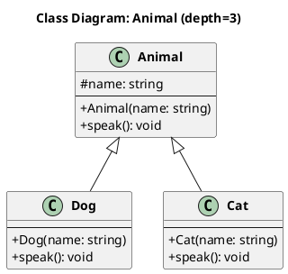

# C++ to PlantUML Converter

C++ 프로젝트를 분석하여 PlantUML 클래스 다이어그램으로 변환하는 데스크톱 애플리케이션입니다.

## Features

- **C++ 파싱**: 클래스, 구조체, 멤버 변수, 메서드, 상속 관계 추출
- **두 가지 파서 모드**:
  - **Regex 모드**: 설치 불필요, 빠른 분석
  - **libclang 모드**: 정확한 AST 기반 분석 (LLVM 필요)
- **관계 분석**: 상속, 구성, 집합, 의존 관계 자동 감지
- **Depth 제한**: 연관 클래스 탐색 깊이 설정 (기본값: 3)
- **필터 옵션**:
  - 관계 유형 필터 (상속/구성/집합/의존)
  - 클래스 구성요소 필터 (멤버변수/멤버함수)
- **미리보기**: Text/Image 토글로 다이어그램 미리보기
- **검색**: 클래스 목록에서 검색 기능

## Screenshots

```
┌─────────────────────────────────────────────────┐
│  C++ to PlantUML Converter                      │
├─────────────────────────────────────────────────┤
│  [Settings]                                     │
│  Project Folder: [____________] [Browse...]     │
│  Start Class:    [____________]  Depth: [3]     │
│  Parser Mode:    ○ Regex  ○ libclang           │
├─────────────────────────────────────────────────┤
│  [Filter Options]                               │
│  ☐ 상속  ☐ 구성  ☐ 집합  ☐ 의존               │
│  ☐ 멤버변수  ☐ 멤버함수                        │
├─────────────────────────────────────────────────┤
│  [Parse Project] [Generate Diagram] [Gen All]   │
├─────────────────────────────────────────────────┤
│  ┌─────────┐  ┌──────────────────────────────┐  │
│  │ Classes │  │ PlantUML Output              │  │
│  │ ☑ Foo   │  │ @startuml                    │  │
│  │ ☑ Bar   │  │ class Foo { ... }            │  │
│  └─────────┘  └──────────────────────────────┘  │
└─────────────────────────────────────────────────┘
```

## Installation

### 기본 설치

```bash
# 저장소 클론
git clone https://github.com/BibimChoi/cpptouml.git
cd cpptouml

# 의존성 설치 (선택사항)
pip install -r requirements.txt
```

### 선택적 의존성

```bash
# 이미지 미리보기 기능
pip install Pillow

# libclang 모드 (LLVM 설치 필요)
pip install clang
```

## Usage

### 실행

```bash
python main.py
```

### 사용 방법

1. **Project Folder**: C++ 프로젝트 폴더 선택
2. **Parse Project**: 프로젝트 파싱
3. **Start Class**: 시작 클래스 선택
4. **Depth**: 탐색 깊이 설정
5. **Generate Diagram**: 다이어그램 생성

### 버튼 설명

| 버튼 | 설명 |
|------|------|
| Parse Project | 선택한 폴더의 C++ 파일 분석 |
| Generate Diagram | Start Class 기준으로 Depth만큼 탐색하여 다이어그램 생성 |
| Generate All Classes | 좌측 체크된 클래스들만 포함하여 다이어그램 생성 |

### 필터 옵션

**관계 유형 (Depth 탐색에 영향)**:
- 상속 (Inheritance): `<|--`
- 구성 (Composition): `*--`
- 집합 (Aggregation): `o--`
- 의존 (Dependency): `..>`

**클래스 구성요소 (표시에 영향)**:
- 멤버변수 (Members)
- 멤버함수 (Methods)

> 선택 안함 또는 모두 선택 = 전체 적용

## Output Example



## File Structure

```
cpp2plantuml/
├── main.py               # 메인 UI (Tkinter)
├── cpp_parser.py         # Regex 기반 C++ 파서
├── cpp_parser_clang.py   # libclang 기반 C++ 파서
├── relationship.py       # 클래스 관계 분석기
├── plantuml_generator.py # PlantUML 코드 생성기
├── requirements.txt      # 의존성 목록
└── README.md             # 이 파일
```

## Requirements

- Python 3.8+
- tkinter (보통 Python에 기본 포함)
- Pillow (선택, 이미지 미리보기용)
- clang (선택, libclang 모드용)

## Limitations

- Regex 모드는 복잡한 템플릿이나 매크로를 완벽히 파싱하지 못할 수 있음
- libclang 모드 사용 시 LLVM/Clang 설치 필요
- 이미지 미리보기는 PlantUML 서버에 의존 (인터넷 필요)

## License

MIT License

## Contributing

이슈 및 PR 환영합니다.
